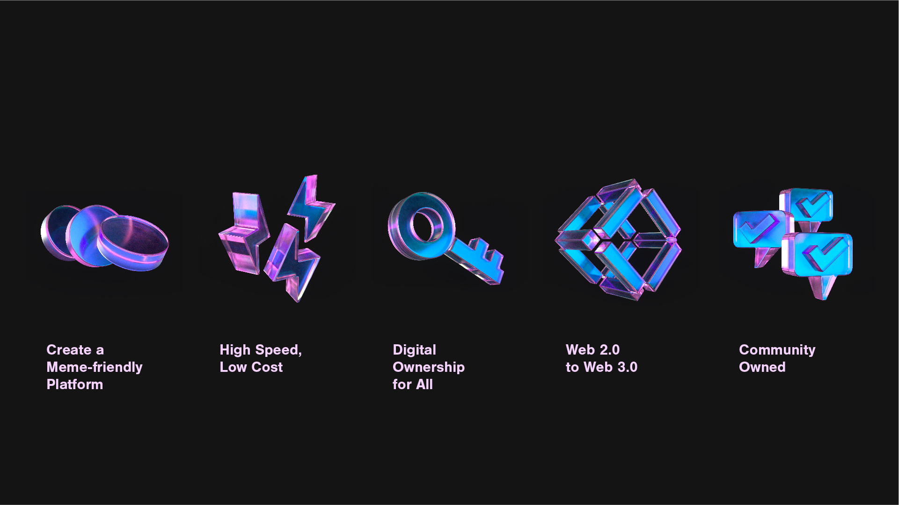

# 2.1. Mission

Memes are like transformative and renewable energy that stands the test of time. Through adaptations of text, images, video clips, sound, or the combination of these elements, memes are humorous manifestations that convey cultural ideas, symbols, or practices. \
\
We believe a successful meme may even be powerful enough to prevent a war or save a country. Also, memes are the best weapon in our language arsenal in the digital social world that drives our communication forward in the digital era. \
\
The internet widens the possibilities of memes, and we foresee that blockchain technology will empower memes to a new height. \
\
With the MEME Network, we aim to become the most successful Web3 project that provides a platform for users to create memes to influence the world.

<figure><figcaption></figcaption></figure>
