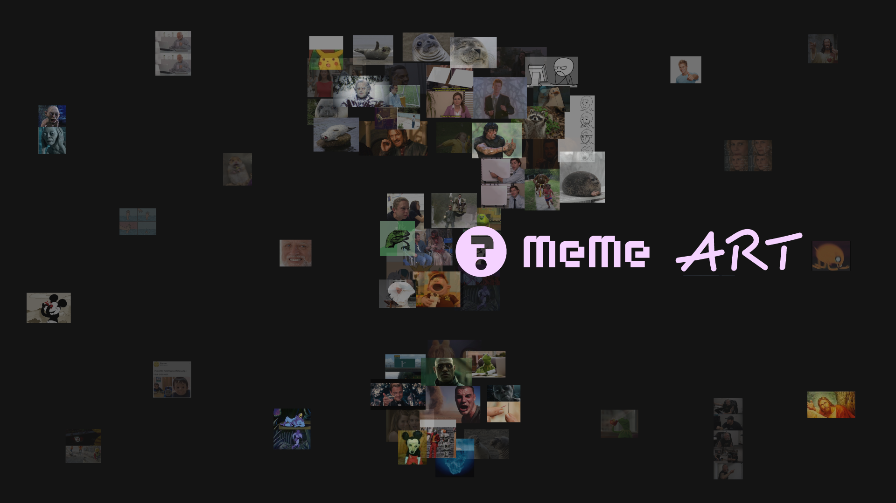
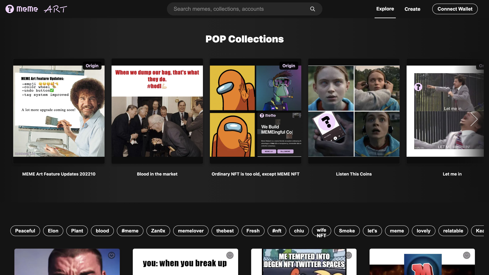
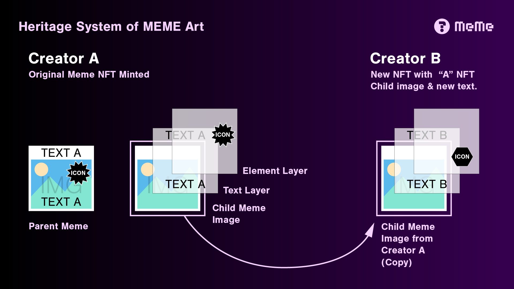

# 2.2. MEME Art

<figure><figcaption></figcaption></figure>

Meme Network brings new and unique utilities to the Cosmos ecosystem and embraces the interoperability of IBC (Inter Blockchain Communication) to supercharge our applications.

### Memes & NFTs

MEME Art, is a creative application that offers essential features to create memes. All creations produced in MEME Art can be minted as [NFTs (non-fungible tokens)](../../1.-market-overview/1.2.-nft-creation-and-trading.md) and are capable to be stored and exchanged in our [MEME NFT Marketplace](../2.4.-meme-marketplace.md), where memers are all granted true ownership of their works as well as freedom to maximize creativity. In addition, use cases and subsequent sales in the secondary market could bring memers royalty income.

Meme economy has been a controversial topic. As memes become an internet commodity, a good meme can even be positioned as a creative asset or a new form of currency across social media. We believe that there should be a better way to monetize memes. Meme Art fixes it and aims to explore various solutions to incentivize memers and end users to create and utilize memes on a daily basis.

<figure><figcaption>
MEME Art (testnet) Platform
</figcaption></figure>

### Heritage System

The core of the economy is driven by a scheme named Heritage System that can be associated as a family tree in the production process of a meme. For example, a Parent Meme can be an original image or design element (e.g. a comic strip), and someone can transform it into a Child Meme by adding text or drawing. All memers, including **creators**, **collectors**, and **regular users**, will own a portfolio to showcase their collections. Creators will receive incentive in $MEME when the assets are utilized, the more popular an assets is, the more profit it will generate.

<figure><figcaption>
Heritage System of MEME Art
</figcaption></figure>

### Gallery Mode

In Gallery mode, most of the features will be available without the requirement of a wallet connection. Users can **view**, **like**, **bookmark**, and **share any asset**. The curated shop-window landing page will showcase the top trending assets, plus various collections curated by our team or top-tier memers. As the library grows, an advanced filter will be added in the search function.

### Creator Mode

There are two different ways to access the Creator tool.

The default Easy mode offers the most essential features, where users can create meme assets in just a few simple steps: Choose an image, add text, a title, tag, and then mint it into a NFT (wallet connection required).

All features will be unlocked in the Pro mode, including the Painter tool, which empowers memers to apply creativity in their works with the various drawing functionalities, filters, and effects. The system will automatically engage in Pro mode when altering or importing an existing meme NFT (parent or child meme) for recreation.
