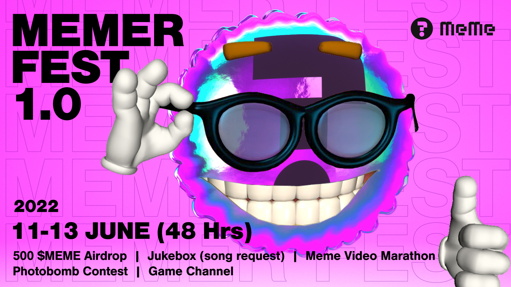
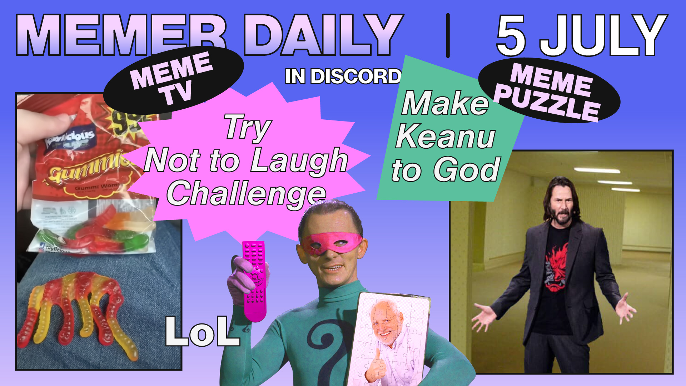

# 2.3. MEME Festival

Our community is united by the memers, who are a great mix of individuals including meme lovers, meme creators, validators, developers, bloggers, and influencers in the crypto space.

We believe that the future of the Internet is driven by the community, so facilitating an engaging environment will always be one of our key missions. In the beginning, we started an official Discord channel and organized a number of events in various formats, including:

### Memer Fest

Memer Fest is an occasional campaign led by some major achievements of the project.

<figure><figcaption>
The MEMER FEST 1.0
</figcaption></figure>

The first Memer Fest was organized as a celebration of the milestone of **4,000 Twitter followers**, **in which a 48-hour** live event offered an array of activities dedicated to the internet meme culture including meme creator contest, games, music and video channel, and time-limited airdrop, creating a ritual to reunite memers and have fun.

### Memer Daily

Memer Daily has been running as an ad-hoc initiative in daily or weekly format.&#x20;

<figure><figcaption>
MEMER DAILY GAMES
</figcaption></figure>

We completed our first 2-week iteration of Memer Daily as an experiment. On a daily basis, we initiated 2 main programs: **Meme TV** and **Meme Puzzle**. Meme TV was a combination of a meme-video showcase and a photo-hunt game. Meme Puzzle was a meme creator contest based on various themes. Memer Daily will be resumed after our on-chain meme creator tool, MEME Art, is officially released, and we foresee that the hype and excitement will be multiplied.

**In future events, we aim to design more amusing programs to engage with developers and validators.**
