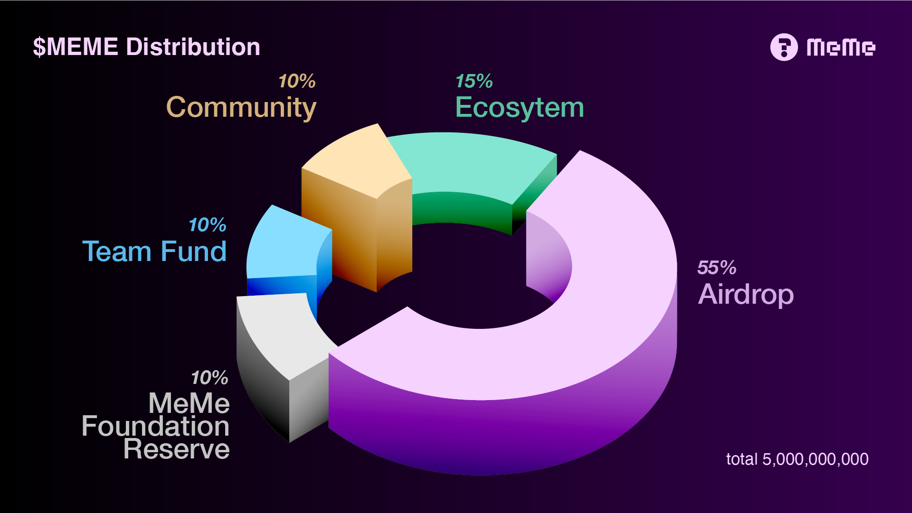
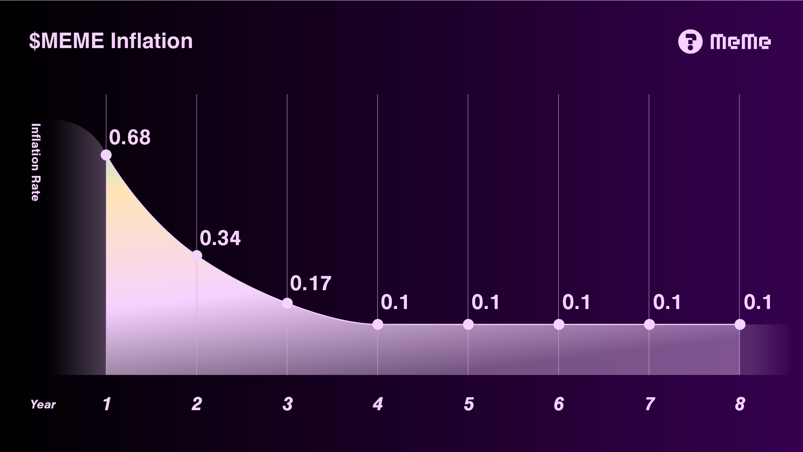

# 4.1. Initial Tokenomic

## $MEME Genesis supply

Meme Network starts with an initial supply of 5,000,000,000 MEME tokens. The 5 billion $MEME initial supply commemorates the milestone of the milestone global digital population and the internet users reaching 5 billion while Meme Network is on-chain in April 2022.

<figure><figcaption></figcaption></figure>

### <mark style="color:purple;">Airdrop 55%</mark>

Meme Network offers Airdrop of 2.75 billion $MEME tokens, 55% of the genesis token share to ATOM and OSMO holders. The goal of the $MEME Airdrop is to encourage internet users to actively participate in memetics through social media. All of the internet information and resources are owned by the contributors, no matter creators, users, and readers. We believe in creating long-term value throughout the interchange and aim to reflect that with MEME airdrop.

### <mark style="color:green;">Ecosystem 15%</mark>

The ecosystem reserves 15% of the genesis token share, which is 750 million $MEME $MEME, to offer incentives to MEME contributors and hold Meme Network marketing promotions. At least 50% of the share (375 million $MEME) will be locked out of any sale until more than 75% of the more than 75% of the $MEME token distribution is owned by the public participants.

### <mark style="color:yellow;">Community 10%</mark>

Meme Network reserves 10% of the genesis supply, which is 500 million $MEME,, for the community pool. The pool will be used to improve and enhance the ecosystem and governance of the MEME Network. The purpose of the community pool is for the Meme Network community to efficiently leverage the available tooling, infrastructure, educational content, and other resources during the bootstrapping phase.

### Foundation 10%

The foundation retains 10% of the genesis supply, , which is 500 million $MEME. This pool is used for Meme Network infrastructure development. The majority of the share will be locked out of any sale until 75% of the $MEME token distribution is owned by the public participants.

### <mark style="color:blue;">Team fund 10%</mark>

10% of the genesis supply, that is, that is 500 million $MEME,, is reserved for the development team, and the founder team will have the right to participate in the project’s governance. Our development team has agreed to comply with the “lock-up period” rules for holding the majority of the share until Phase one application and tools are used comprehensively in the market.

## Inflation

<figure><figcaption></figcaption></figure>

The genesis supply is 5 billion $MEME. Additional MEME will be minted based on the on-chain inflation to control the fund. Initially, the Meme Network adopts a relatively high inflation rate of 68%, and it shall fluctuate over time depending on the bonded token ratio. TheThe inflation rate will then then be gradually halved to 10% per year and remains until the maximum supply is reached.
