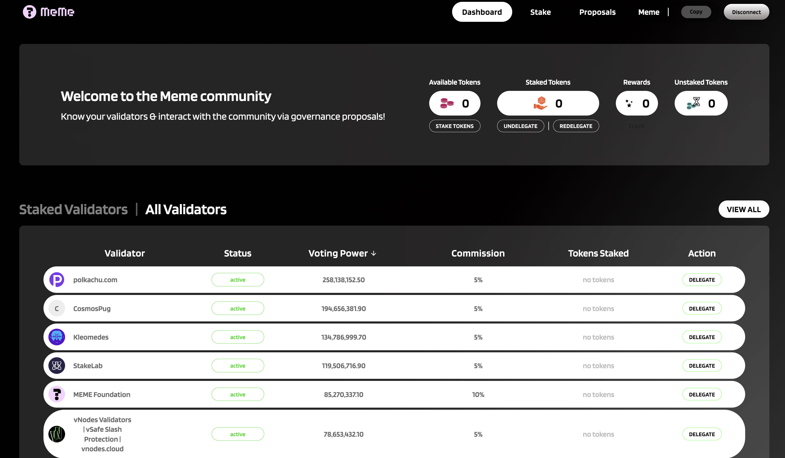

# 4.3. MEME’s Staking

<figure><figcaption></figcaption></figure>

Staking is a term referring to how much holdings are being staked and the length of time they’re being staked. It is the process of locking up tokens to support a network that generates rewards in return (which can be increased network utility, monetary compensation, etc.) – a staker can earn a proportion of the rewards.&#x20;

Staking is a way of earning interest on your cryptocurrency by depositing it for a fixed period. Staking works in a similar way to interest accounts with traditional banks.&#x20;

Traditional banks pay interest because the bank uses your funds for things like loans and other investments. In staking, your cryptocurrency is put to use as well: your deposited coins are used to verify transactions on the blockchain, and you will receive rewards in return (rewards can be increased network utility, monetary compensation, etc.).

### Proof-of-stake crypto about $MEME

$MEME is a proof-of-stake crypto. Every time a block is added to the blockchain, new cryptocurrency coins are minted and distributed as staking rewards to that block’s validator. In most cases, the rewards are the same type of cryptocurrency participants are staking. Staking involves validators locking up their coins so they can be selected randomly by the protocol to create a block.&#x20;

When participants pledge their coins to the cryptocurrency protocol, the protocol chooses validators from these participants to confirm blocks of transactions. Your coins are still in your possession when you stake them; you’re essentially putting those staked coins to work, and you’re free to unstake them later if you want to trade them.

### **Three advantages of staking $MEME**

#### **1.**  Maintain chain security

You can contribute to the security of the decentralized network by staking (delegating) $MEME to a validator.

#### **2. Earn $MEME rewards**

Delegating $MEME to one or more validators means you get more and more $MEME!

#### **3. Gain voting power**

Staking $MEME grants you voting power on governance proposals to decide on the future of Meme Network.

### **How to choose validators?**

The validator selection is crucial as they support the MEME Network’s stability, security and evolutions. Your chosen validators represent their delegator (Staker) to participate in our community discussion and vote on the governance proposals.  \
\
Meme Network does not recommend choosing a validator for its high ranking of voting power, low/ zero commission fees, or with an uptime below 100%. \
\
Staking your $MEME to different validators as much as possible is advisable since the decentralized network is the core infrastructure of Web 3.0. \
\
Thus, Meme Network suggests choosing the “Active” validators for staking $MEME. You can check the validator status at [https://wallet.meme.sx/stake](https://wallet.meme.sx/stake) or [https://ping.pub/meme](https://ping.pub/meme).

**Staking your $MEME now!!**
