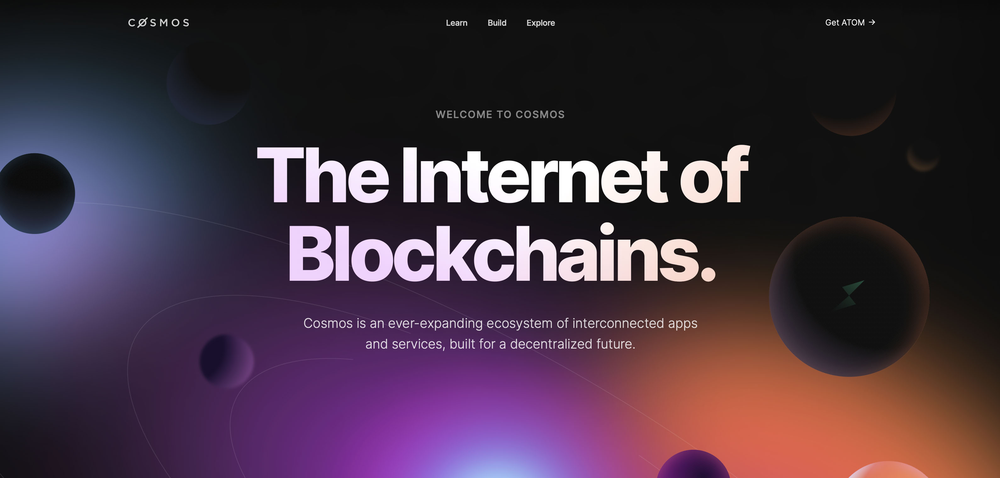

# 5.1. Cosmos Layer 1

<figure><figcaption></figcaption></figure>

**Sovereignty**

Sovereignty allows Meme Network to bootstrap our validator set and security measures, and take control over its operation. For example, if there is a new feature request, we can submit a governance proposal and apply it exclusively to the Meme Network once the application is passed.

**Inter-Blockchain Communication (IBC)**

IBC leverages the instant finality property of the Tendermint Consensus to enable heterogeneous blockchains to exchange tokens and data with one another. It allows the Meme Network to interoperate with other Tendermint-based blockchains without sacrificing its custom security measures and consensus.

**Cosmos Software Development Kit (SDK)**

With the Cosmos SDK framework, the Meme Network can create a secure application blockchain with ease and make use of the prebuilt modules, for example ​​staking and governance. As a result, the development team can focus on the development of the applications but not on the underlying layers.
