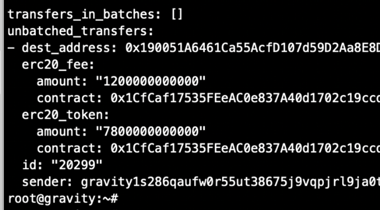

# 5.3 Gravity Bridge

The [Althea team](https://www.althea.net) has built the [Gravity Bridge](https://www.gravitybridge.net), which is a trustless and neutral bridge connecting the Ethereum and Cosmos ecosystems. The bridge uses the validator set to sign transactions instead of a multi-sig or permissioned set of actors.

The Gravity community's sole focus is on providing the most effective and secure bridge possible, rather than on a DeFi application on the local chain. This increases efficiency and reduces costs. The Gravity Bridge validator set handles all control over the bridge, which aggregates volume from multiple blockchains and sources.

This guide will help you send funds from the MEME Network via IBC to the ERC20 wMEME contract on the main Ether network and back again. Don't worry, it's easy! Just make sure that your wallet on the MEME Network, Gravity Bridge, and Ether has enough funds to cover any petrol costs on each chain other than the transferred funds.

### IBC Overview

| Chain ID         | Channel     | Demon                                                                |
| ---------------- | ----------- | -------------------------------------------------------------------- |
| meme-1           | channel-9   | meme                                                                 |
| gravity-bridge-3 | channel-149 | ibc/0EB6D5E44D1587D12E222C1155181884098202F56263795259C53536D07C2E65 |

### Ethereum

<table><thead><tr><th width="139">Chain ID </th><th>Contract</th></tr></thead><tbody><tr><td>1</td><td><a href="https://etherscan.io/token/0x1cfcaf17535feeac0e837a40d1702c19ccdc1f41">https://etherscan.io/token/0x1cfcaf17535feeac0e837a40d1702c19ccdc1f41</a></td></tr></tbody></table>


### **Send $MEME from MEME Chain to Gravity Bridge**

Hey there! To send MEME from MEME Network to Gravity Bridge, you can follow these simple steps. As an example, we'll send 1000 MEME. First, head over to channel-9, which is the official channel to send MEME via IBC to Gravity Bridge. Then, change \<YOUR\_GRAVITY\_WALLET\_ADDRESS> to the bech32 gravity prefixed address from the previous gravity keys add  command.

Usage: `memed tx ibc-transfer transfer [src-port] [src-channel] [receiver] [amount] [flags]`

```
memed tx ibc-transfer transfer channel-9 <YOUR_GRAVITY_WALLET_ADDRESS> 1000000000umeme \
--from <WALLET NAME> \
--gas auto \
--gas-adjustment 1.2 \
--gas-prices 0.025umeme \
--chain-id "meme-1" \
--node "https://rpc-meme-1.meme.sx:443"
```


### Send IBC MEME from Gravity Bridge to wMEME ERC-20

If you have confirmed that $MEME is in your Gravity Bridge wallet, and have enough GAS FEE, you should be able to send some of the funds via the bridge to wMEME ERC-20 on Ether.&#x20;

In our example, we will send 5,000,000 $MEME, and set the Bridge Fee to 1,000,000 $MEME, and the Chain Fee to 100,000 $MEME, which should hopefully be sent in bulk by the Gravity Bridge Repeater in a few hours to three days (although it may take less or more time depending on the number of bridge transactions to be processed, and whether the Bridge Fee is sufficient). (although it may take less or more time depending on the number of bridges to be processed and whether bridge fees are sufficient). We'll use the Gravity Bridge cli to do this, replacing <0xYOUR\_ETH\_WALLET> with the address of the Ethernet wallet you wish to receive wMEME:

Usage: `gravity tx gravity send-to-eth [eth-dest] [amount] [bridge-fee] [chain-fee] [flags]`

```
gravity tx gravity send-to-eth \
<0x YOUR_ETH_WALLET> \
5000000000000ibc/0EB6D5E44D1587D12E222C1155181884098202F56263795259C53536D07C2E65 \
1000000000000ibc/0EB6D5E44D1587D12E222C1155181884098202F56263795259C53536D07C2E65 \
100000000000ibc/0EB6D5E44D1587D12E222C1155181884098202F56263795259C53536D07C2E65 \
--node https://gravitychain.io:26657 \
--from <WALLET NAME> \
--fees 0ugraviton \
--gas 400000 \
--chain-id gravity-bridge-3 \
--keyring-backend os
```


After sending, you will be able to check the status of the bridge transfer in batches or unbatched:

```
gravity query gravity pending-send-to-eth <YOUR_GRAVITY_WALLET_ADDRESS> \
  --node https://gravitychain.io:26657 \
  --chain-id gravity-bridge-3
```

<figure><figcaption><p>output</p></figcaption></figure>

If your transaction is in unbatched\_transfers, don't worry, it's just waiting for the repeater to add it to the batch.

On the other hand, if your transaction is in transfers\_in\_batches, it has already been batched and is now waiting for the relay to send it to ERC-20.

After a while, you should see 5,000,000 $MEME in your Ether Wallet.


### Cancelling an ERC-20 bridge transaction is easy!

If you need to change the transaction amount or if your transaction has been in unbatched\_transfers for a while, you can simply cancel the transaction and try again by adding some bridge fees.

To cancel the transaction, make a note of the id value output by the previous command (in this case 20299) and then run the following command, replacing \<THE\_ID> with the ID of the transaction you want to cancel:

```
  gravity tx gravity cancel-send-to-eth 20297 \
    --node https://gravitychain.io:26657 \
    --fees 0ugraviton \
    --chain-id gravity-bridge-3 \
    --from <WALLET NAME> \
  --keyring-backend os
```


### Gravity Bridge Portal&#x20;

I wanted to let you know that the Gravity Bridge Portal is now available for you to transfer funds between different chains with ease.








