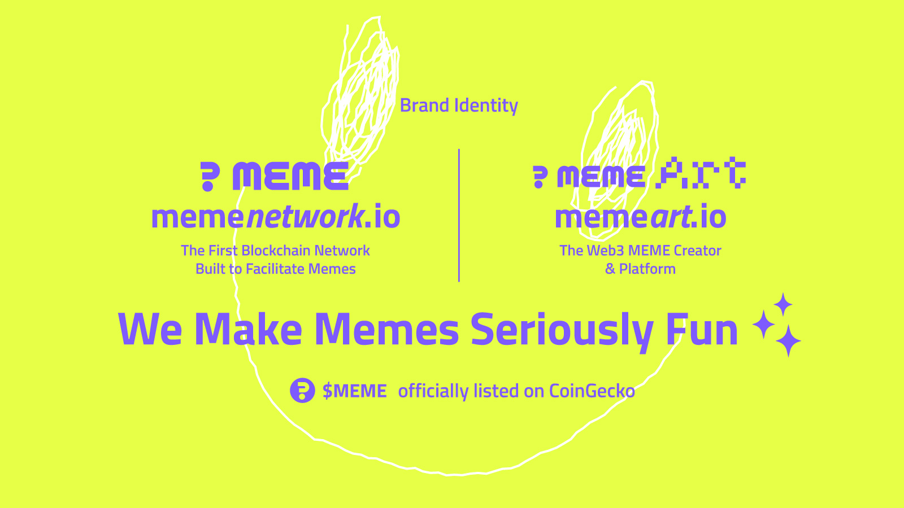

# MEME Network Whitepaper

<figure><figcaption></figcaption></figure>

### Description&#x20;

MEME Network is a Web 3.0-based Crypto project themed on Meme culture. It provides solutions for users to play, earn, and invest. The core members comprise worldwide experts specializing in different fields.

### Products & Services

Initially, we plan to provide web content creation tools, an NFT-related platform, Web 3.0 communication tools, and an Incubator platform. On top of these services, we have built the MEME Network, a layer one blockchain, on the Cosmos Ecosystem. Since mid-2022, $MEME coins have been trading at DApp of Cosmos - Osmosis Frontier.

### SWOT Analysis

Unlike the meme-themed projects widely spread in the crypto world, MEME Network itself isn’t a MEME project but a platform for content creators to craft their products, such as NFTs, GIFs, Discord messages, Tweets, etc. Even though we may be relatively weak in the technological aspect amongst the fierce competition, we believe MEME is a powerful weapon that can influence the world and give rise to endless possibilities. The growth of the MEME Network is expected to be strong as the meme culture gains momentum in popularity.

### Market Analysis

As one of the sizable crypto ecosystems, Cosmos has over 40 layer-one chains. After the Luna / UST incident, the Cosmos ecosystem consists of approximately USD$250M (as of Nov 2022) liquidity in the liquidity pool for coin users to trade.

### Marketing Plan

To introduce the MEME Network to users, we have spent a lot of effort on social media and GitHub to share our ideas and motivations. From hundreds of posts and entries on social media to several major marketing events, we have gained **15K Twitter followers** and **12K Discord page members**. To further develop the chain, marketing events are a focus to attract meme lovers and quality users to take part in our network.
